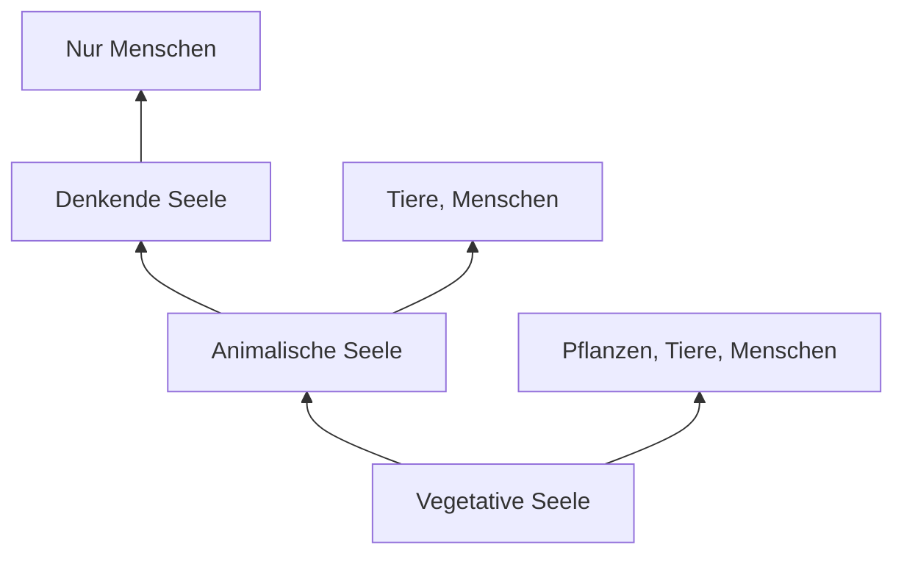

# Aristoteles (384-322 v.Chr.)

> Seele und Körper als untrennbare Einheit

---

## Kurzprofil

| Aspekt | Information |
|--------|-------------|
| **Lebensdaten** | 384 - 322 v.Chr. |
| **Geburtsort** | Stageira, Makedonien |
| **Lehrer** | Platon (20 Jahre an der Akademie) |
| **Schüler** | Alexander der Große |
| **Schule** | Lykeion (335 v.Chr. gegründet) |

---

## Philosophische Position

### Ablehnung des Dualismus

**Gegen Platons Trennung:**
- Seele und Körper sind **untrennbar verbunden**
- Keine Seele ohne Körper möglich
- Seele = "Vervollständigung des Körpers" (Entelechie)

| Platon | Aristoteles |
|--------|-------------|
| Seele unabhängig vom Körper | Seele nur mit Körper |
| Körper = Gefängnis | Körper = notwendig |
| Seele unsterblich | Nur nous (Geist) unsterblich? |

### Hylemorphismus
- **Hyle** = Materie (Körper)
- **Morphe** = Form (Seele)
- Beide zusammen bilden das Lebewesen

---

## Das Drei-Seelen-Modell

### Hierarchie der Seelenarten

| Seelenart | Griechisch | Wesen | Fähigkeiten |
|-----------|------------|-------|-------------|
| **Vegetative** (Pflanzenseele) | to threptikon | Pflanzen, Tiere, Menschen | Ernährung, Wachstum, Fortpflanzung |
| **Animalische** (Tierseele) | to aisthetikon | Tiere, Menschen | + Sinneswahrnehmung, Begierde, Fortbewegung |
| **Denkende** (Geistseele) | to noetikon | Nur Menschen | + Logik, abstraktes Denken |

> **Wichtig:** Die höheren Seelenformen **beinhalten** die niedrigeren. Der Mensch hat alle drei.

---

## Wichtige Konzepte

### Entelechie
- Seele = das, was den Körper **verwirklicht**
- Nicht trennbar wie Form von Material
- Beispiel: Auge sehen → Seele des Auges

### Der Nous (Geist)
- Höchste Seelenfähigkeit
- Möglicherweise doch unsterblich?
- Passiver vs. aktiver Nous

### Seelenvermögen

| Vermögen | Funktion |
|----------|----------|
| Wahrnehmung | Sinneseindrücke aufnehmen |
| Vorstellung (Phantasia) | Bilder im Geist formen |
| Gedächtnis | Vergangenes speichern |
| Denken | Abstrakte Schlüsse ziehen |
| Begehren | Antrieb zum Handeln |

---

## "De Anima" (Über die Seele)

**Erstes systematisches Werk über die Psyche**

Behandelte Themen:
- Definition der Seele
- Wahrnehmung und Sinne
- Vorstellung und Gedächtnis
- Denken und Nous
- Bewegung und Begehren

> Dieses Werk beeinflusste das Denken über die Psyche für fast 2000 Jahre!

---

## Relevanz für die Psychologie

| Aristotelisches Konzept | Moderne Entsprechung |
|------------------------|---------------------|
| Einheit Seele-Körper | Psychosomatik, embodied cognition |
| Hierarchie der Funktionen | Evolutionäre Psychologie |
| Phantasia | Mentale Vorstellung |
| Gedächtnis | Gedächtnisforschung |
| Begehren als Antrieb | Motivation |

---

## Einfluss auf die Wissenschaft

### Mittelalter
- **Thomas von Aquin:** Verbindung mit Christentum (Scholastik)
- Aristoteles = "Der Philosoph"

### Moderne
- Funktionalistische Ansätze
- Evolutionäre Perspektive auf Psyche
- Embodiment-Theorien

---

## Prüfungsrelevanz

**Must-Know:**
- Seele & Körper = untrennbar
- Seele = "Vervollständigung des Körpers"
- Drei Seelenarten (vegetativ, animalisch, denkend)
- Unterschied zu Platon!

---

## Verknüpfungen
- [[Platon]] (Lehrer)
- [[Philosophische-Wurzeln]]
- [[02-Geschichte-der-Psychologie]]
- [[Personen-Index]]

#person #antike #monismus
