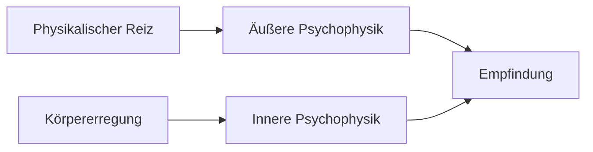

# Gustav Theodor Fechner (1801-1887)

> Begründer der Psychophysik

---

## Kurzprofil

| Aspekt | Information |
|--------|-------------|
| **Lebensdaten** | 19. April 1801 - 18. November 1887 |
| **Geburtsort** | Groß Särchen, Sachsen |
| **Hauptwirkungsort** | Leipzig |
| **Bekannt für** | Psychophysik, Weber-Fechner-Gesetz |

---

## Bedeutung

### Begründer der Psychophysik

**Zentrale Frage:**
> Wie hängen physikalische Reize mit psychischem Erleben zusammen?

**Revolutionäre Leistung:**
- Nachweis, dass psychische Prozesse **messbar** sind
- Widerlegung von Kants Behauptung (Psychologie nicht mathematisierbar)
- Grundlage für experimentelle Psychologie

---

## Die Psychophysik

### Zwei Arten

| Art | Untersucht | Beispiel |
|-----|------------|----------|
| **Äußere Psychophysik** | Reiz → Empfindung | Lichtintensität → Helligkeitserleben |
| **Innere Psychophysik** | Körpererregung → Empfindung | Nervenaktivität → Erleben |

### Das Weber-Fechner-Gesetz

**Webers Gesetz (Ernst Heinrich Weber):**
- Konstantes Verhältnis: ΔI/I = k
- Der eben merkliche Unterschied ist proportional zur Reizstärke

**Fechners Erweiterung:**
- E = k · log(I) + C
- **E** = Empfindungsstärke
- **I** = Reizintensität
- Empfindung wächst logarithmisch mit Reizstärke

> Beispiel: Um einen doppelt so lauten Ton wahrzunehmen, braucht man nicht die doppelte, sondern eine viel höhere physikalische Intensität.

---

## Die Grenzmethode

**Methode der ebenmerklichen Unterschiede**

### Ablauf

1. Standardreiz präsentieren
2. Vergleichsreiz variieren (auf-/absteigend)
3. Versuchsperson urteilt: "gleich" oder "verschieden"
4. Schwelle bestimmen

### Schwellenarten

| Schwelle | Definition |
|----------|------------|
| **Absolute Schwelle** | Minimale Reizstärke für Wahrnehmung |
| **Unterschiedsschwelle** | Minimaler Unterschied zwischen zwei Reizen |

### Weitere psychophysische Methoden

| Methode | Beschreibung |
|---------|--------------|
| **Grenzmethode** | Systematische Reizvariation |
| **Herstellungsmethode** | VP stellt selbst einen Reiz her |
| **Konstanzmethode** | Zufällige Darbietung verschiedener Reize |

---

## Fechners methodischer Durchbruch

**Erster Wissenschaftler, der:**
- Psychologische Theorieentwicklung **konsequent vom Experiment her** betrieb
- Quantitative Gesetze für psychische Prozesse formulierte
- Systematische Messmethoden entwickelte

> Dies war der entscheidende Schritt zur Psychologie als empirische Wissenschaft!

---

## Wichtige Werke

| Jahr | Werk |
|------|------|
| 1860 | **"Elemente der Psychophysik"** |
| 1876 | "Vorschule der Ästhetik" |

**"Elemente der Psychophysik" (1860):**
- Gründungswerk der Psychophysik
- Zwei Bände
- Darstellung aller Methoden und Gesetze

---

## Der "Fechner-Tag"

**22. Oktober 1850**
- Fechner hatte eine Erleuchtung
- Idee des logarithmischen Zusammenhangs
- Wird manchmal als Geburtstag der Psychophysik bezeichnet

---

## Weitere Interessen

- **Ästhetik:** Experimentelle Ästhetik
- **Philosophie:** Panpsychismus (alles hat Seele)
- **Satire:** Schrieb unter Pseudonym "Dr. Mises"

---

## Prüfungsrelevanz

**Must-Know:**
- Begründer der Psychophysik
- Äußere vs. Innere Psychophysik
- Weber-Fechner-Gesetz
- Grenzmethode
- "Elemente der Psychophysik" (1860)
- Erster experimenteller Ansatz zur Messung des Psychischen

---

## Verknüpfungen
- [[Anfaenge-wissenschaftliche-Psychologie]]
- [[02-Geschichte-der-Psychologie]]
- [[Wilhelm-Wundt]]
- [[03-Methodenlehre]]
- [[Personen-Index]]

#person #psychophysik #19jahrhundert
