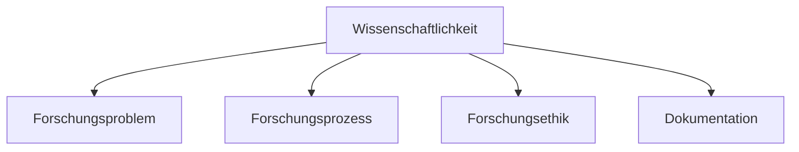

# Psychologische Forschung und Methodenlehre

> Die wissenschaftliche Methode als Grundlage psychologischer Erkenntnis

---

## Kapitelstruktur

1. [[Alltagspsychologie-vs-Wissenschaft]] - Warum Methodenlehre?
2. [[Theorien-und-Hypothesen]] - Forschungsfragen entwickeln
3. [[Operationalisierung]] - Messen und Erheben
4. [[Experimentelle-Methode]] - Kausalität nachweisen
5. [[Deskriptive-Statistik]] - Daten beschreiben

---

## 1. Alltagspsychologie vs. wissenschaftliche Psychologie

→ [[Alltagspsychologie-vs-Wissenschaft]]

### Unterschied

| Aspekt  | Alltagspsychologie     | Wissenschaftliche Psychologie |
| ------- | ---------------------- | ----------------------------- |
| Basis   | Persönliche Erfahrung  | Systematische Forschung       |
| Methode | Intuition, Heuristiken | Wissenschaftliche Methode     |
| Prüfung | Keine systematische    | Empirische Überprüfung        |
| Ziel    | Alltag bewältigen      | Fundierte, prüfbare Aussagen  |

### Kognitive Verzerrungen (Biases)

**Warum der "gesunde Menschenverstand" oft falsch liegt:**

| Verzerrung             | Englisch          | Beschreibung                                                                |
| ---------------------- | ----------------- | --------------------------------------------------------------------------- |
| **Rückschaufehler**    | Hindsight Bias    | "Das habe ich doch gewusst!" - Nachher glauben, man hätte es vorher gewusst |
| **Bestätigungsfehler** | Confirmation Bias | Informationen bevorzugen, die eigene Meinung bestätigen                     |

### Heuristiken

> Faustregeln für schnelle Entscheidungen bei unvollständigen Informationen

**Repräsentativitätsheuristik:**

-   Annahme: Typischere Ereignisse sind wahrscheinlicher
-   Beispiel: KKKKK vs KZZKZ beim Münzwurf → beide gleich wahrscheinlich!

### Kritisches Denken

**Der erste Schritt zur Wissenschaftlichkeit:**

-   Systematisches Hinterfragen
-   Bewertung von Informationen
-   Fragen: Woher? Was genau? Genug Evidenz?

---

## 2. Standards der Wissenschaftlichkeit

### Die 4 Standards (nach Döring)



| Standard              | Beschreibung                                  |
| --------------------- | --------------------------------------------- |
| **Forschungsproblem** | Empirisch untersuchbar, theoretisch erklärbar |
| **Forschungsprozess** | Etablierte Methoden, regelkonform             |
| **Forschungsethik**   | Ethische Regeln einhalten                     |
| **Dokumentation**     | Nachvollziehbar und replizierbar              |

### Replikation

**Arten von Replikationsstudien:**

| Art                              | Ziel                                                        |
| -------------------------------- | ----------------------------------------------------------- |
| **Direkte (exakte) Replikation** | Originalstudie möglichst genau nachstellen                  |
| **Konzeptionelle Replikation**   | Aspekte systematisch variieren → Generalisierbarkeit prüfen |

**Replikationskrise:**

-   Viele Befunde lassen sich nicht replizieren
-   Ursachen: Datenfälschung, methodische Fehler
-   Lösung: Transparenz, Datenveröffentlichung

---

## 3. Der wissenschaftliche Forschungsprozess

### Quantitative vs. Qualitative Forschung

| Aspekt            | Quantitativ             | Qualitativ                |
| ----------------- | ----------------------- | ------------------------- |
| **Ziel**          | Messen, Vergleichen     | Verstehen, Interpretieren |
| **Fokus**         | Gruppen                 | Einzelpersonen            |
| **Daten**         | Zahlen                  | Texte, Interviews         |
| **Vorherrschend** | Ja (in der Psychologie) | Ergänzend                 |

### Die 7 Schritte des Forschungsprozesses

```
1. Forschungsfragestellung wählen
        ↓
2. Theoretische Einbettung & Hypothesenableitung
        ↓
3. Operationalisierung & Untersuchungsplanung
        ↓
4. Durchführung & Datenerhebung
        ↓
5. Datenaufbereitung & Datenanalyse
        ↓
6. Interpretation & Diskussion
        ↓
7. Publikation / Präsentation
```

---

## 4. Theorien und Hypothesen

→ [[Theorien-und-Hypothesen]]

### Definitionen

| Begriff       | Definition                                                              |
| ------------- | ----------------------------------------------------------------------- |
| **Theorie**   | Geordnete Menge von Begriffen und Aussagen zur Erklärung von Phänomenen |
| **Hypothese** | Konkrete, überprüfbare Vermutung über einen Sachverhalt                 |

### Anforderungen an wissenschaftliche Hypothesen

1. **Präzise und widerspruchsfrei** - Kein Raum für Interpretation
2. **Prinzipiell widerlegbar** (Falsifizierbarkeit)
3. **Operationalisierbar** - Begriffe messbar
4. **Begründbar** - Auf Forschungsstand basierend

**Wichtig:** Hypothesen müssen **VOR** der Datensammlung aufgestellt werden!

### Arten von Hypothesen

| Art                        | Beschreibung                    | Beispiel                              |
| -------------------------- | ------------------------------- | ------------------------------------- |
| **Unterschiedshypothese**  | Unterschied zwischen Gruppen    | "Männer sind größer als Frauen"       |
| **Zusammenhangshypothese** | Zusammenhang zwischen Variablen | "Je mehr Lernen, desto bessere Noten" |
| **Veränderungshypothese**  | Veränderung über Zeit           | "Therapie reduziert Symptome"         |

**Gerichtet vs. Ungerichtet:**

-   **Ungerichtet:** "Es gibt einen Unterschied"
-   **Gerichtet:** "Gruppe A ist höher als Gruppe B"

### Kovariation und Kausalität

> **Korrelation ≠ Kausalität!**

**Voraussetzungen für Kausalität:**

1. Kovariation (Zusammenhang) zwischen A und B
2. A tritt zeitlich **vor** B auf
3. Andere Ursachen können **ausgeschlossen** werden

---

## 5. Operationalisierung und Untersuchungsplanung

→ [[Operationalisierung]]

### Zentrale Begriffe

```
Merkmal (Eigenschaft einer Person)
    ↓ Operationalisierung
Variable (messbare Größe)
    ↓ Messung
Daten (Zahlenwerte)
```

| Begriff                 | Definition                                   |
| ----------------------- | -------------------------------------------- |
| **Merkmal**             | Eigenschaft eines Objekts/einer Person       |
| **Operationalisierung** | Festlegung, wie ein Merkmal gemessen wird    |
| **Variable**            | Das operationalisierte Merkmal               |
| **Messung**             | Zuordnung von Zahlen zu Merkmalsausprägungen |

### Latente vs. Manifeste Merkmale

| Art          | Beschreibung             | Beispiel                       |
| ------------ | ------------------------ | ------------------------------ |
| **Manifest** | Direkt beobachtbar       | Körpergröße, Reaktionszeit     |
| **Latent**   | Nicht direkt beobachtbar | Intelligenz, Angst, Motivation |

> Bei latenten Merkmalen: Rückschluss von manifesten Indikatoren!

### Psychometrische Gütekriterien

| Kriterium        | Definition                         | Frage                                         |
| ---------------- | ---------------------------------- | --------------------------------------------- |
| **Objektivität** | Unabhängig von der Versuchsleitung | Kommen verschiedene VL zum gleichen Ergebnis? |
| **Reliabilität** | Zuverlässigkeit, Messgenauigkeit   | Gleiches Ergebnis bei Wiederholung?           |
| **Validität**    | Misst, was es zu messen vorgibt    | Misst der IQ-Test wirklich Intelligenz?       |

### Skalenniveaus

| Niveau         | Eigenschaften           | Beispiel                      | Aussagen möglich   |
| -------------- | ----------------------- | ----------------------------- | ------------------ |
| **Nominal**    | Kategorien              | Nationalität, Geschlecht      | Gleich/Verschieden |
| **Ordinal**    | + Rangordnung           | Schulnoten, Bildungsabschluss | Größer/Kleiner     |
| **Intervall**  | + gleiche Abstände      | Temperatur (°C), IQ           | Differenzen        |
| **Verhältnis** | + natürlicher Nullpunkt | Reaktionszeit, Gewicht        | Verhältnisse       |

---

## 6. Stichproben

### Grundbegriffe

| Begriff                          | Definition                                            |
| -------------------------------- | ----------------------------------------------------- |
| **Population (Grundgesamtheit)** | Alle Fälle, über die Aussagen getroffen werden sollen |
| **Stichprobe**                   | Teilmenge der Population                              |
| **Versuchsperson (VP)**          | Person in der Stichprobe                              |
| **Repräsentativität**            | Stichprobe = Miniaturabbild der Population            |

### Stichprobenarten

| Art                        | Beschreibung                   | Qualität                     |
| -------------------------- | ------------------------------ | ---------------------------- |
| **Zufallsstichprobe**      | Jede Person hat gleiche Chance | Ideal, aber schwer umsetzbar |
| **Gelegenheitsstichprobe** | Wer gerade verfügbar ist       | Praktisch, aber verzerrt     |

---

## 7. Studiendesigns

### Labor- vs. Felduntersuchung

| Aspekt                | Laboruntersuchung | Felduntersuchung    |
| --------------------- | ----------------- | ------------------- |
| **Ort**               | Labor             | Natürliche Umgebung |
| **Kontrolle**         | Hoch              | Gering              |
| **Authentizität**     | Gering            | Hoch                |
| **Interne Validität** | Höher             | Niedriger           |
| **Externe Validität** | Niedriger         | Höher               |

### Interne und Externe Validität

| Validitätsart         | Frage                                        | Erhöhung durch            |
| --------------------- | -------------------------------------------- | ------------------------- |
| **Interne Validität** | Eindeutiger Kausalschluss möglich?           | Kontrolle, Randomisierung |
| **Externe Validität** | Übertragbar auf andere Personen/Situationen? | Repräsentative Stichprobe |

---

## 8. Die experimentelle Methode

→ [[Experimentelle-Methode]]

### Merkmale eines Experiments

1. **Systematische Variation** einer Variable (UV)
2. **Kontrolle** von Störvariablen

### Variablenarten

| Variable                 | Abk. | Beschreibung                    |
| ------------------------ | ---- | ------------------------------- |
| **Unabhängige Variable** | UV   | Wird manipuliert (Ursache)      |
| **Abhängige Variable**   | AV   | Wird gemessen (Wirkung)         |
| **Störvariable**         | SV   | Potenzielle Alternativerklärung |

> **Randomisierung** ist DAS zentrale Element eines echten Experiments!

**Quasi-Experiment:** Alle Kriterien erfüllt, ABER keine Randomisierung möglich

---

## 9. Erwartungseffekte

### Auf Seiten der Versuchspersonen

| Effekt                             | Beschreibung                                        |
| ---------------------------------- | --------------------------------------------------- |
| **Reaktivität / Hawthorne-Effekt** | Verhalten ändert sich durch Wissen über Beobachtung |
| **Placebo-Effekt**                 | Positive Wirkung ohne Wirkstoff                     |

### Kontrolle von Erwartungseffekten

| Methode               | Wer weiß nicht Bescheid?           |
| --------------------- | ---------------------------------- |
| **Blindversuch**      | Versuchsperson                     |
| **Doppelblindstudie** | Versuchsperson UND Versuchsleitung |

---

## 10. Deskriptive Statistik

→ [[Deskriptive-Statistik]]

### Übersicht

| Bereich              | Inhalt                          |
| -------------------- | ------------------------------- |
| **Häufigkeiten**     | Wie oft kommt etwas vor?        |
| **Zentrale Tendenz** | Was ist der "typische" Wert?    |
| **Streuung**         | Wie stark variieren die Werte?  |
| **Zusammenhang**     | Hängen zwei Variablen zusammen? |

---

## Wichtige Begriffe im Überblick

| Begriff                 | Definition                             |
| ----------------------- | -------------------------------------- |
| **Heuristik**           | Faustregel für schnelle Entscheidungen |
| **Operationalisierung** | Messbarmachung von Konzepten           |
| **Randomisierung**      | Zufällige Zuweisung zu Gruppen         |
| **Konfundierung**       | Vermischung von UV und Störvariable    |
| **Replikation**         | Wiederholung einer Studie              |
| **Validität**           | Gültigkeit einer Messung/Studie        |

---

## Verknüpfungen

-   Vorheriges: [[Geschichte-der-Psychologie]]
-   Nächstes: [[04-Biologische-Psychologie]]
-   [[Ethik-in-der-Psychologie]]
