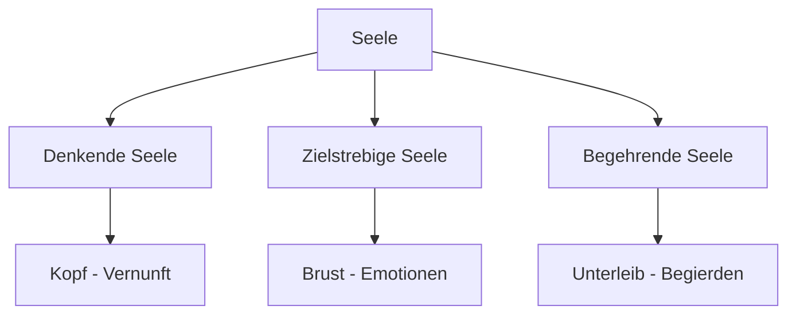

# Philosophische Wurzeln der Psychologie

> Von der Antike bis zum Mittelalter

---

## Zeitleiste

```
600 v.Chr.  ─── Orphiker
400 v.Chr.  ─── Platon, Aristoteles
200 n.Chr.  ─── Galen
400 n.Chr.  ─── Augustinus
1250        ─── Thomas von Aquin
```

---

## Die Orphiker (~600 v.Chr.)

**Erste systematische Seelenlehre**

-   Griechische religiöse Bewegung
-   Grundlegender **Dualismus**:
    -   Körper = stofflich
    -   Seele = unstofflich
-   **Seele ist unsterblich**
-   Körper = "Gefängnis der Seele"
-   Glaube an **Seelenwanderung** (Metempsychose)

> Die Orphiker legten den Grundstein für die spätere philosophische
> Unterscheidung zwischen Körper und Geist.

---

## Platon (427-347 v.Chr.)

→ [[Platon]]

### Grundposition

-   **Dualistisch & Idealistisch**
-   Seele = unsterblich, vollkommen
-   Körper = trügerisch, unvollkommen
-   Wahre Erkenntnis nur durch die Seele möglich

### Das Drei-Seelen-Modell



| Teilseele                      | Lokalisation | Funktion              | Tugend     |
| ------------------------------ | ------------ | --------------------- | ---------- |
| **Denkende** (logistikon)      | Kopf         | Vernunft, Kontrolle   | Weisheit   |
| **Zielstrebige** (thymoeides)  | Brust        | Emotionen, Mut        | Tapferkeit |
| **Begehrende** (epithymetikon) | Unterleib    | Körperliche Begierden | Mäßigung   |

### Wagenlenker-Gleichnis

Die vernünftige Seele lenkt wie ein Wagenlenker zwei Pferde:

-   Das edle Pferd (Mut, Ehre)
-   Das wilde Pferd (Begierden)

---

## Aristoteles (384-322 v.Chr.)

→ [[Aristoteles]]

### Grundposition

-   Schüler Platons, später eigene Schule (Lykeion)
-   **Ablehnung des Dualismus**
-   Seele & Körper = **untrennbar verbunden**
-   Seele = "Vervollständigung des Körpers" (Entelechie)

### Das Drei-Seelen-Modell

| Seelenart                      | Wesen                     | Fähigkeiten                                 |
| ------------------------------ | ------------------------- | ------------------------------------------- |
| **Vegetative** (Pflanzenseele) | Pflanzen, Tiere, Menschen | Ernährung, Wachstum, Fortpflanzung          |
| **Animalische** (Tierseele)    | Tiere, Menschen           | + Sinneswahrnehmung, Begierde, Fortbewegung |
| **Denkende** (Geistseele)      | Nur Menschen              | + Logik, abstraktes Denken                  |

> **Wichtig:** Die höheren Seelenformen beinhalten die niedrigeren. Der Mensch
> hat alle drei.

### "De Anima" (Über die Seele)

-   Erstes systematisches Werk über die Psyche
-   Behandelt Wahrnehmung, Gedächtnis, Vorstellung, Denken

---

## Die Temperamentenlehre

### Hippokrates (460-370 v.Chr.)

-   "Vater der Medizin"
-   **Vier-Säfte-Lehre** (Humoralpathologie)
-   Gesundheit = Gleichgewicht der vier Körpersäfte

### Galen (129-199 n.Chr.)

-   Verband Körpersäfte mit **Persönlichkeitstypen**
-   Grundlage der Temperamentenlehre

| Temperament       | Körpersaft     | Organ  | Eigenschaften                      |
| ----------------- | -------------- | ------ | ---------------------------------- |
| **Sanguiniker**   | Blut           | Herz   | Heiter, optimistisch, gesellig     |
| **Phlegmatiker**  | Schleim        | Gehirn | Ruhig, gelassen, langsam           |
| **Choleriker**    | Gelbe Galle    | Leber  | Reizbar, energisch, dominant       |
| **Melancholiker** | Schwarze Galle | Milz   | Nachdenklich, traurig, empfindlich |

> Diese Einteilung beeinflusste die Persönlichkeitspsychologie bis ins 20.
> Jahrhundert (z.B. Eysenck)!

---

## Mittelalter

### Augustinus (354-430 n.Chr.)

-   Christliche Philosophie
-   **Innerer Mensch** (Seele) vs. **Äußerer Mensch** (Körper)
-   Introspektion als Weg zur Wahrheit
-   "In dir selbst kehre ein, im inneren Menschen wohnt die Wahrheit"

### Thomas von Aquin (1225-1274)

-   **Scholastik**: Versöhnung von Aristoteles und Christentum
-   Übernahm Aristoteles' Drei-Seelen-Modell
-   Seele = unsterblich (christlich), aber mit Körper verbunden (aristotelisch)

---

## Zusammenfassung: Entwicklung des Seelenbegriffs

| Denker          | Verhältnis Körper-Seele                   |
| --------------- | ----------------------------------------- |
| Orphiker        | Strenger Dualismus                        |
| Platon          | Dualismus, Seele überlegen                |
| Aristoteles     | Einheit, Seele als Form des Körpers       |
| Augustinus      | Dualismus, Innenschau                     |
| Thomas v. Aquin | Synthese: Einheit mit unsterblicher Seele |

---

## Verknüpfungen

-   [[Geschichte-der-Psychologie]]
-   [[Rationalismus-vs-Empirismus]]
-   [[Platon]]
-   [[Aristoteles]]
