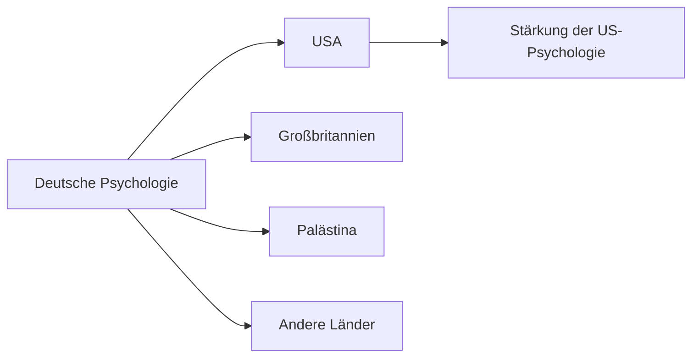

# Psychologie im Nationalsozialismus

> Eine dunkle Epoche der deutschen Psychologiegeschichte (1933-1945)

---

## Überblick

Die NS-Zeit hatte tiefgreifende Auswirkungen auf die deutsche Psychologie:

-   Vertreibung jüdischer und politisch unerwünschter Wissenschaftler
-   Instrumentalisierung für NS-Ideologie
-   Gleichzeitig: Professionalisierung des Fachs

---

## Vertreibung und Emigration

### Entlassungen ab 1933

-   "Gesetz zur Wiederherstellung des Berufsbeamtentums"
-   Entlassung jüdischer und politisch unerwünschter Professoren
-   **~35% der Universitätslehrenden** betroffen

### Emigrationswelle

**Prominente Emigranten:**

| Person           | Emigrationsziel | Bedeutung                   |
| ---------------- | --------------- | --------------------------- |
| Charlotte Bühler | USA             | Entwicklungspsychologie     |
| Max Wertheimer   | USA (1933)      | Gestaltpsychologie          |
| Kurt Lewin       | USA (1933)      | Feldtheorie, Gruppendynamik |
| Wolfgang Köhler  | USA (1935)      | Gestaltpsychologie          |
| Sigmund Freud    | London (1938)   | Psychoanalyse               |

> Die Emigrationswelle führte zu einem enormen Wissenstransfer in die USA,
> während die deutsche Psychologie geschwächt wurde.

---

## Verfolgung und Ermordung

**Inhaftierte Psychologen:**

-   **Viktor Frankl** - KZ-Überlebender, begründete später Logotherapie
-   **Heinrich Düker** - Arbeitspsychologe

**Ermordete Psychologen:**

-   **Otto Selz** - Denkpsychologe, in Auschwitz ermordet
-   **Kurt Huber** - Mitglied der "Weißen Rose", hingerichtet

---

## Psychologie unter dem NS-Regime

### Rassenpsychologie

-   "Rassenseelenkunde" als neuer Forschungsschwerpunkt
-   Pseudowissenschaftliche Untermauerung der NS-Ideologie
-   Versuch, "arische" Überlegenheit zu beweisen

### Aufschwung der Diagnostik

**Wehrmacht-Psychologie:**

-   Eignungsauswahl für Offiziere
-   Entwicklung von Testverfahren
-   Ausbau der angewandten Psychologie

| Anwendungsbereich  | Ziel                              |
| ------------------ | --------------------------------- |
| Offiziersauswahl   | Führungseignung prüfen            |
| Fliegerauswahl     | Belastbarkeit, Reaktionsfähigkeit |
| Charakterprüfungen | "Wehrtauglichkeit"                |

### Erste Diplomprüfungsordnung (1941)

**Paradox:** Gerade in der NS-Zeit wurde Psychologie als eigenständiger
Studiengang etabliert

-   Professionalisierung des Fachs
-   Standardisierte Ausbildung
-   Trennung von Philosophie

---

## Ambivalenz der Entwicklung

| Negative Aspekte            | "Positive" Entwicklungen       |
| --------------------------- | ------------------------------ |
| Vertreibung führender Köpfe | Professionalisierung           |
| Rassenideologie             | Erste Prüfungsordnung          |
| Instrumentalisierung        | Ausbau angewandter Psychologie |
| Mord an Wissenschaftlern    | Eigenständiger Studiengang     |

> Diese "positiven" Entwicklungen sind kritisch zu sehen, da sie im Kontext der
> NS-Herrschaft und für deren Zwecke erfolgten.

---

## Folgen für die Nachkriegszeit

### Personelle Kontinuitäten

-   Viele NS-belastete Psychologen machten nach 1945 Karriere
-   Späte Aufarbeitung der Fachgeschichte
-   Erst ab den 1980er Jahren kritische Reflexion

### Verlust für die deutsche Psychologie

-   Gestaltpsychologie wanderte in die USA ab
-   Psychoanalyse musste neu aufgebaut werden
-   Internationale Isolation

---

## Wichtige Daten

| Jahr | Ereignis                                  |
| ---- | ----------------------------------------- |
| 1933 | Entlassungsgesetz, erste Emigrationswelle |
| 1935 | Nürnberger Gesetze                        |
| 1938 | Reichspogromnacht, Freud emigriert        |
| 1941 | Erste Diplomprüfungsordnung               |
| 1945 | Kriegsende                                |

---

## Lehren für heute

-   **Wissenschaft ist nicht wertfrei** - sie kann missbraucht werden
-   **Ethische Grundsätze** sind unverzichtbar
-   **Kritische Reflexion** der eigenen Fachgeschichte notwendig
-   → [[Ethik-in-der-Psychologie]]

---

## Verknüpfungen

-   [[Geschichte-der-Psychologie]]
-   [[Gestaltpsychologie]]
-   [[Tiefenpsychologie]]
-   [[Ethik-in-der-Psychologie]]
