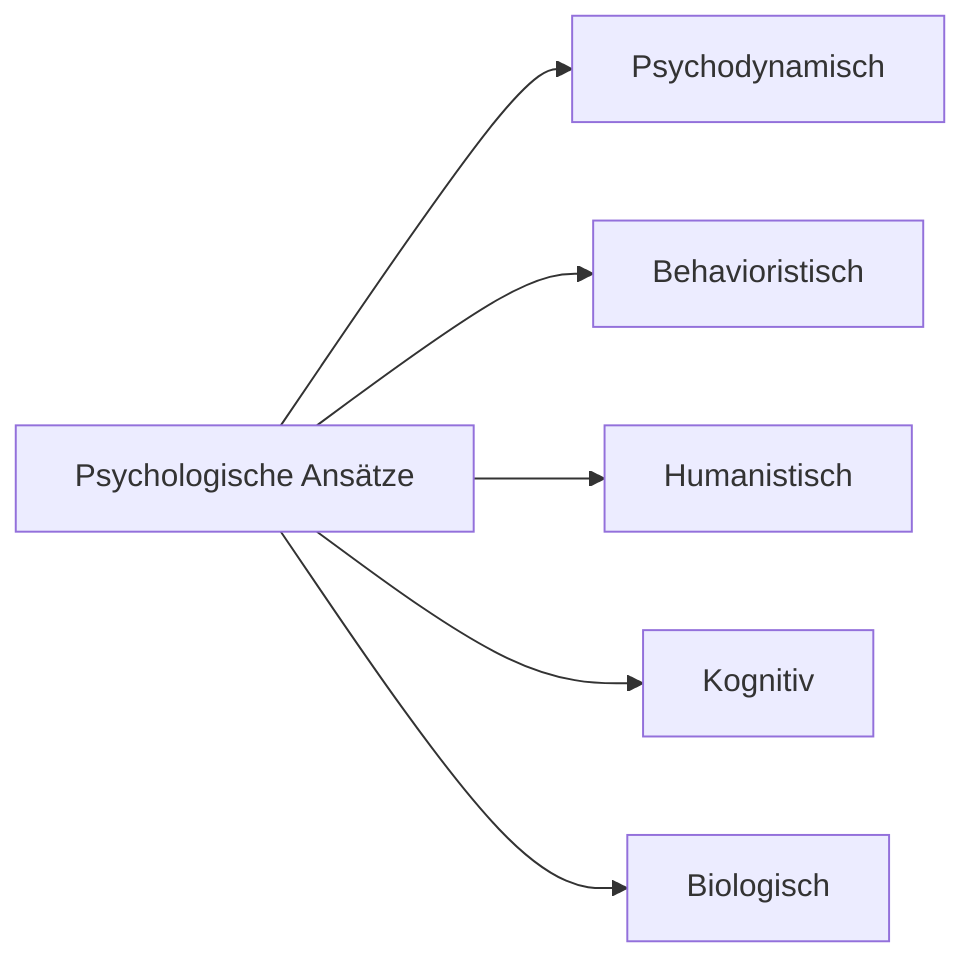

# Psychologische Ansätze

> Verschiedene Perspektiven zur Erklärung menschlichen Erlebens und Verhaltens

---

## Übersicht

---

## 1. Psychodynamischer Ansatz

**Grundannahme:** Verhalten wird durch starke innere Kräfte (Triebe) beeinflusst

-   Verhalten = Konfliktlösung zwischen Bedürfnissen & sozialen Erfordernissen
-   **Unbewusste Prozesse** beeinflussen Verhalten
-   Begründer: [[Sigmund-Freud]]
-   → Mehr in [[Geschichte-der-Psychologie]] und
    [[08-Persoenlichkeitspsychologie]]

---

## 2. Behavioristischer Ansatz

**Grundannahme:** Verhalten durch beobachtbare Reize und Reaktionen erklärbar

-   Fokus auf **beobachtbares Verhalten**
-   Mentale Prozesse werden **nicht** berücksichtigt ("Black Box")
-   Begründer: [[John-Watson]]
-   → Mehr in [[Behaviorismus]] und [[Lernen]]

---

## 3. Humanistischer Ansatz

**Grundannahme:** Mensch strebt nach positiver Entwicklung

-   Entwickelte sich ab 1950 als Alternative
-   **Holistische Herangehensweise** - Mensch als Ganzes
-   Zentrale Elemente:
    -   Freiheit
    -   Selbst (Selbstverwirklichung)
    -   Bedürfnisse & Ziele
-   Vertreter: [[Carl-Rogers]], [[Abraham-Maslow]], Charlotte Bühler

---

## 4. Kognitiver Ansatz

**Grundannahme:** Nicht direkt beobachtbare Vorgänge sind zentral

-   Fokus: Aufmerksamkeit, Wahrnehmung, Denken, Erinnern
-   Menschen handeln weil sie **denken können**
-   Verhalten ≠ nur Resultat externer Bedingungen
-   Dominierender Ansatz der modernen Psychologie
-   → Mehr in [[Kognitive-Wende]]

---

## 5. Biologisch-neurowissenschaftlicher Ansatz

**Grundannahme:** Psychische Phänomene = biochemische Vorgänge

-   Beteiligte Systeme:
    -   Gene
    -   Nervensystem
    -   Hormonsystem
-   → Führte zu **kognitiven Neurowissenschaften**
-   → Mehr in [[04-Biologische-Psychologie]]

---

## Eklektischer Ansatz

> Kombination mehrerer Perspektiven für komplexe Phänomene

Die Ansätze schließen sich **nicht** gegenseitig aus, sondern **ergänzen** sich!

---

## Anwendung in der Therapie

| Ansatz          | Therapieform                     |
| --------------- | -------------------------------- |
| Psychodynamisch | Psychoanalyse                    |
| Behavioristisch | Verhaltenstherapie               |
| Humanistisch    | Gesprächspsychotherapie (Rogers) |
| Kognitiv        | Kognitive Verhaltenstherapie     |

---

## Verknüpfungen

-   [[Was-ist-Psychologie]]
-   [[Geschichte-der-Psychologie]]
