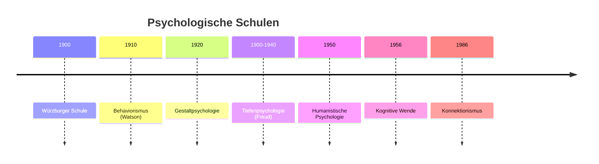

# Psychologische Schulen des 20. Jahrhunderts

> Die großen Paradigmen der modernen Psychologie

---

## Übersicht



---

## 1. Würzburger Schule

→ [[Wuerzburger-Schule]]

### Grundlagen

-   **Begründer:** Oswald Külpe (Schüler von Wundt)
-   **Ort:** Universität Würzburg
-   **Zeit:** ca. 1896-1920

### Zentrale Frage

> "Wie laufen Denkvorgänge ab?"

### Methode

-   Kontrollierte Introspektion
-   "Denksportaufgaben" mit anschließender Selbstbeobachtung
-   Systematische Befragung der Versuchspersonen

### Wichtige Erkenntnisse

-   **Unanschauliches Denken:** Denken ohne Vorstellungsbilder möglich
-   **Bewusstseinslagen:** Vage Bewusstseinszustände zwischen Gedanken
-   **Einstellungen:** Aufgabenspezifische mentale Bereitschaften

### Bedeutung

-   Wegbereiter der **Kognitiven Psychologie**
-   Erweiterung von Wundts Ansatz
-   Kritik am reinen Elementarismus

---

## 2. Gestaltpsychologie

→ [[Gestaltpsychologie]]

### Grundlagen

-   **Ort:** Berlin/Frankfurt
-   **Zeit:** 1920er-1930er Jahre
-   **Hauptvertreter:** Max Wertheimer, Wolfgang Köhler, Kurt Koffka, Kurt Lewin

### Grundprinzip

> **"Das Ganze ist etwas Anderes als die Summe seiner Teile"**

### Die Gestaltgesetze

| Gesetz                    | Beschreibung                                | Beispiel                                      |
| ------------------------- | ------------------------------------------- | --------------------------------------------- |
| **Nähe**                  | Nahe Elemente = zusammengehörig             | ●● ●● wird als 2 Paare gesehen                |
| **Ähnlichkeit**           | Ähnliche Elemente = zusammengehörig         | ●●○○ wird gruppiert                           |
| **Gute Fortsetzung**      | Linien werden fortlaufend wahrgenommen      | X wird als zwei sich kreuzende Linien gesehen |
| **Geschlossenheit**       | Tendenz zur Vervollständigung               | ◠ wird als Kreis wahrgenommen                 |
| **Prägnanz**              | Einfachste Interpretation bevorzugt         |                                               |
| **Gemeinsames Schicksal** | Zusammen bewegte Elemente = zusammengehörig |                                               |

### Kurt Lewins Feldtheorie

**Grundformel:** V = f(P, U)

-   **V** = Verhalten
-   **P** = Person
-   **U** = Umwelt

**Zentrale Konzepte:**

-   **Lebensraum:** Psychologische Umwelt einer Person
-   **Valenz:** Aufforderungscharakter von Objekten
    -   Positive Valenz → Annäherung
    -   Negative Valenz → Vermeidung

---

## 3. Behaviorismus

→ [[Behaviorismus]]

### Grundlagen

-   **Ort:** USA
-   **Zeit:** Ab ~1913
-   **Begründer:** John Watson

### Grundposition

-   Nur **beobachtbares Verhalten** ist Forschungsgegenstand
-   Mentale Prozesse = **"Black Box"** (nicht berücksichtigt)
-   Psychologie als objektive Naturwissenschaft

### Das S-R-Schema

```
Stimulus (Reiz) → [Black Box] → Response (Reaktion)
```

### Wichtige Konzepte und Vertreter

| Konzept                          | Vertreter | Beschreibung                        |
| -------------------------------- | --------- | ----------------------------------- |
| **Klassische Konditionierung**   | Pawlow    | Lernen durch Reizverknüpfung        |
| **Operante Konditionierung**     | Skinner   | Lernen durch Verstärkung/Bestrafung |
| **Reiz-Reaktions-Verknüpfungen** | Thorndike | Law of Effect                       |
| **Neobehaviorismus**             | Hull      | + Organismusvariable (S-O-R)        |

### Klassische Konditionierung (Pawlow)

```
Vor Konditionierung:
  Futter (UCS) → Speichelfluss (UCR)
  Glocke (NS) → keine Reaktion

Während Konditionierung:
  Glocke + Futter → Speichelfluss

Nach Konditionierung:
  Glocke (CS) → Speichelfluss (CR)
```

### Operante Konditionierung (Skinner)

| Konsequenz               | Verhalten wird... |
| ------------------------ | ----------------- |
| **Positive Verstärkung** | häufiger          |
| **Negative Verstärkung** | häufiger          |
| **Positive Bestrafung**  | seltener          |
| **Negative Bestrafung**  | seltener          |

---

## 4. Tiefenpsychologie

→ [[Tiefenpsychologie]]

### Grundannahme

-   **Unbewusste** seelische Vorgänge beeinflussen Verhalten
-   Fokus auf Kindheitserfahrungen und Triebe

### Sigmund Freud (1856-1939) - Psychoanalyse

**Topographisches Modell:**

-   Bewusstes
-   Vorbewusstes
-   Unbewusstes

**Strukturmodell (Instanzenmodell):**

| Instanz      | Funktion                      | Prinzip             |
| ------------ | ----------------------------- | ------------------- |
| **Es**       | Triebe, Wünsche               | Lustprinzip         |
| **Ich**      | Vermittlung, Realitätsprüfung | Realitätsprinzip    |
| **Über-Ich** | Moral, Gewissen               | Moralisches Prinzip |

**Abwehrmechanismen:**

-   Verdrängung
-   Projektion
-   Sublimierung
-   Rationalisierung

### Alfred Adler - Individualpsychologie

-   **Minderwertigkeitsgefühle** als Motor der Entwicklung
-   **Geltungsstreben** vs. **Gemeinschaftsgefühl**
-   Neurose = Überkompensation

### C.G. Jung - Analytische Psychologie

-   **Libido** = allgemeine Lebensenergie (nicht nur sexuell)
-   **Kollektives Unbewusstes** = gemeinsames Erbe der Menschheit
-   **Archetypen** = universelle Urbilder (Magna Mater, Animus/Anima, Schatten)

---

## 5. Humanistische Psychologie

→ [[Humanistische-Psychologie]]

### Grundlagen

-   **Zeit:** Ab 1950er Jahre
-   **Hauptvertreter:** Carl Rogers, Abraham Maslow, Charlotte Bühler

### Als "Dritte Kraft"

-   Gegenbewegung zu Psychoanalyse UND Behaviorismus
-   Mensch = nicht nur von Trieben oder Reizen gesteuert

### Grundannahmen

-   Mensch strebt nach **positiver Entwicklung**
-   **Holistische** Sichtweise (Mensch als Ganzes)
-   Fokus auf: Freiheit, Selbst, Selbstverwirklichung

### Maslows Bedürfnispyramide

```
         /\
        /  \  Selbstverwirklichung
       /----\
      /      \  Wertschätzung
     /--------\
    /          \  Soziale Bedürfnisse
   /------------\
  /              \  Sicherheit
 /----------------\
/                  \  Physiologische Bedürfnisse
```

### Rogers' Gesprächspsychotherapie

Drei Basisvariablen:

1. **Empathie** - Einfühlendes Verstehen
2. **Kongruenz** - Echtheit des Therapeuten
3. **Wertschätzung** - Bedingungslose positive Zuwendung

---

## 6. Kognitive Wende

→ [[Kognitive-Wende]]

### Meilensteine

-   **1948:** Hixon-Symposium (Beginn)
-   **11. September 1956:** "Geburtsdatum" der Kognitionswissenschaft

### Schlüsselbeiträge 1956

| Disziplin            | Person         | Beitrag               |
| -------------------- | -------------- | --------------------- |
| Psychologie          | George Miller  | **7±2 Regel**         |
| Linguistik           | Noam Chomsky   | Universelle Grammatik |
| Computerwissenschaft | Newell & Simon | Logiktheorie-Maschine |

### Grundannahmen

-   Mensch als **informationsverarbeitendes System**
-   Mentale Prozesse sind wissenschaftlich untersuchbar
-   Nicht nur Reaktion, sondern **interne Handlungsziele**

### TOTE-Modell (Miller)

```
     Test
      ↓
   Match? → Exit
      ↓ No
   Operate
      ↓
     Test
      ...
```

-   **T**est: Prüfung des aktuellen Zustands
-   **O**perate: Handlung zur Zustandsänderung
-   **T**est: Erneute Prüfung
-   **E**xit: Verlassen bei Zielerreichung

---

## 7. Konnektionismus (1986)

### Grundlagen

-   **Begründer:** Rumelhart & McClelland
-   Parallel Distributed Processing (PDP)

### Kernideen

-   **Neuronale Netzwerke** als Modell
-   **Parallele Verarbeitung** statt serieller
-   Lernen durch Anpassung von Verbindungsstärken
-   Vorbild für moderne KI

---

## Vergleichende Übersicht

| Schule            | Fokus                    | Methode       | Menschenbild             |
| ----------------- | ------------------------ | ------------- | ------------------------ |
| Würzburger        | Denken                   | Introspektion | Rationaler Denker        |
| Gestalt           | Wahrnehmung              | Experiment    | Ganzheitlich organisiert |
| Behaviorismus     | Verhalten                | Experiment    | Reaktives Wesen          |
| Tiefenpsychologie | Unbewusstes              | Deutung       | Getriebenes Wesen        |
| Humanistische     | Selbst                   | Gespräch      | Selbstverwirklichend     |
| Kognitive         | Informationsverarbeitung | Experiment    | Computer-Analogie        |

---

## Verknüpfungen

-   [[Geschichte-der-Psychologie]]
-   [[Behaviorismus]]
-   [[Gestaltpsychologie]]
-   [[Tiefenpsychologie]]
-   [[Kognitive-Wende]]
