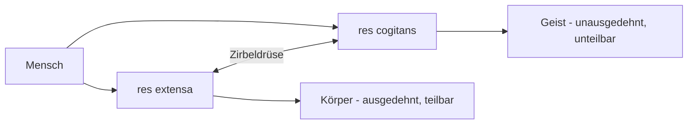

# Rationalismus vs. Empirismus

> Die große erkenntnistheoretische Debatte der Aufklärung

---

## Übersicht

| Aspekt                 | Rationalismus                              | Empirismus                                 |
| ---------------------- | ------------------------------------------ | ------------------------------------------ |
| **Erkenntnisquelle**   | Verstand/Vernunft                          | Sinneserfahrung                            |
| **Methode**            | Deduktion (vom Allgemeinen zum Besonderen) | Induktion (vom Besonderen zum Allgemeinen) |
| **Angeborenes Wissen** | Ja (Ideen sind angeboren)                  | Nein (Tabula rasa)                         |
| **Hauptvertreter**     | Descartes, Spinoza, Leibniz                | Locke, Hume, Berkeley                      |
| **Region**             | Kontinentaleuropa                          | Britische Inseln                           |

---

## Rationalismus

### Grundannahmen

-   Vernunft ist die **primäre Erkenntnisquelle**
-   Bestimmte Ideen sind **angeboren**
-   Sinneswahrnehmung kann täuschen
-   Mathematik als Vorbild für Erkenntnis

### René Descartes (1596-1650)

→ [[Rene-Descartes]]

**Methode des Zweifels:**

-   Systematisches Anzweifeln aller Erkenntnisse
-   Was bleibt übrig, wenn alles angezweifelt wird?

**"Cogito ergo sum"** - Ich denke, also bin ich

-   Das Denken selbst ist unbezweifelbar
-   Grundlage aller Erkenntnis

**Dualistisches Menschenbild:**

| Aspekt        | res extensa          | res cogitans            |
| ------------- | -------------------- | ----------------------- |
| Bedeutung     | Ausgedehnte Substanz | Denkende Substanz       |
| Bezug         | Körper               | Geist/Seele             |
| Eigenschaften | Ausgedehnt, teilbar  | Unausgedehnt, unteilbar |

**Mechanistisches Menschenbild:**

-   Körper funktioniert wie eine Maschine
-   Reflexe als automatische Reaktionen
-   Nur der Geist ist frei

**Zirbeldrüse (Epiphyse):**

-   Verbindungspunkt zwischen Körper und Geist
-   Einziges unpaares Organ im Gehirn

---

## Empirismus

### Grundannahmen

-   **Erfahrung** ist die einzige Erkenntnisquelle
-   Keine angeborenen Ideen
-   Wissen entsteht durch Beobachtung und Experiment
-   Naturwissenschaftliche Methode als Vorbild

### John Locke (1632-1704)

**Tabula rasa** - Das unbeschriebene Blatt

-   Geist bei Geburt = völlig leer
-   Alle Ideen stammen aus Erfahrung

**Zwei Erkenntnisquellen:**

| Quelle        | Beschreibung                              | Beispiel                    |
| ------------- | ----------------------------------------- | --------------------------- |
| **Sensation** | Wahrnehmung äußerer Reize durch die Sinne | Farben sehen, Töne hören    |
| **Reflexion** | Innere Beobachtung des eigenen Denkens    | Erkennen, dass man zweifelt |

**Einfache und komplexe Ideen:**

-   Einfache Ideen: Direkt aus Erfahrung (z.B. "rot", "süß")
-   Komplexe Ideen: Kombination einfacher Ideen (z.B. "Apfel")

### David Hume (1711-1776)

**Radikaler Empirismus:**

-   Noch konsequenter als Locke
-   Selbst Kausalität ist nur Gewohnheit!

**Impressionen und Ideen:** | Typ | Beschreibung | Intensität |
|-----|--------------|------------| | Impressionen | Direkte Sinneseindrücke |
Stark, lebhaft | | Ideen | Erinnerungen, Vorstellungen | Schwach, blass |

**Assoziationstheorie:** Ideen werden verknüpft durch:

1. **Ähnlichkeit** - Ein Bild erinnert an das Original
2. **Kontiguität** - Räumliche/zeitliche Nähe verbindet (Blitz → Donner)
3. **Ursache-Wirkung** - Kausalverbindung (Feuer → Wärme)

> Humes Assoziationsprinzipien wurden später wichtig für den Behaviorismus!

---

## Synthese: Immanuel Kant (1724-1804)

Kant versuchte, beide Positionen zu verbinden:

**"Gedanken ohne Inhalt sind leer, Anschauungen ohne Begriffe sind blind."**

| Element                  | Herkunft                 | Funktion            |
| ------------------------ | ------------------------ | ------------------- |
| **Sinnliche Anschauung** | Erfahrung (Empirismus)   | Liefert Material    |
| **Verstandeskategorien** | Vernunft (Rationalismus) | Ordnen das Material |

**Kants Kategorien** (angeborene Strukturen):

-   Raum und Zeit
-   Kausalität
-   Substanz

> Kant: Psychologie kann keine exakte Wissenschaft sein, weil sie nicht
> mathematisierbar ist. (Später von Herbart widerlegt!)

---

## Bedeutung für die Psychologie

| Tradition         | Einfluss auf Psychologie                                      |
| ----------------- | ------------------------------------------------------------- |
| **Rationalismus** | Betonung innerer mentaler Prozesse, Kognitive Psychologie     |
| **Empirismus**    | Behaviorismus, experimentelle Methode, Lernen durch Erfahrung |

Die Debatte wirkt bis heute nach:

-   **Nativismus** (angeborene Fähigkeiten) vs. **Lerntheorie**
-   **Nature vs. Nurture** Debatte

---

## Verknüpfungen

-   [[Geschichte-der-Psychologie]]
-   [[Philosophische-Wurzeln]]
-   [[Anfaenge-wissenschaftliche-Psychologie]]
-   [[Rene-Descartes]]
-   [[Behaviorismus]]
