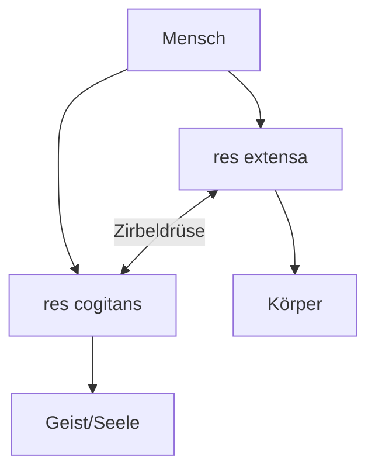

# René Descartes (1596-1650)

> "Cogito ergo sum" - Begründer des modernen Dualismus

---

## Kurzprofil

| Aspekt | Information |
|--------|-------------|
| **Lebensdaten** | 31. März 1596 - 11. Februar 1650 |
| **Geburtsort** | La Haye en Touraine, Frankreich |
| **Hauptwirkungsort** | Niederlande |
| **Bekannt für** | Rationalismus, Dualismus, analytische Geometrie |

---

## Philosophische Position

### Rationalismus

**Grundannahmen:**
- Vernunft = primäre Erkenntnisquelle
- Sinne können täuschen
- Mathematik als Vorbild für Wissen
- Bestimmte Ideen sind angeboren

### Die Methode des Zweifels

**Systematisches Anzweifeln aller Erkenntnisse:**

1. Sinneswahrnehmungen können täuschen
2. Vielleicht träume ich gerade
3. Vielleicht täuscht mich ein böser Dämon

**Was bleibt übrig?**

> **"Cogito ergo sum"** - Ich denke, also bin ich

- Das Denken selbst ist unbezweifelbar
- Wenn ich zweifle, denke ich
- Wenn ich denke, muss ich existieren

---

## Der cartesianische Dualismus

### Zwei Substanzen

| Aspekt | res extensa | res cogitans |
|--------|-------------|--------------|
| **Bedeutung** | Ausgedehnte Substanz | Denkende Substanz |
| **Bezug** | Körper | Geist/Seele |
| **Eigenschaften** | Ausgedehnt, teilbar | Unausgedehnt, unteilbar |
| **Messbarkeit** | Messbar, räumlich | Nicht messbar |
| **Gesetze** | Mechanische Gesetze | Freier Wille |

### Das Leib-Seele-Problem

**Wie interagieren Körper und Geist?**

Descartes' Lösung: **Zirbeldrüse (Epiphyse)**
- Einziges unpaares Organ im Gehirn
- Verbindungspunkt zwischen den Substanzen
- "Sitz der Seele"

> Diese Lösung wurde schon von Zeitgenossen kritisiert: Wie kann Nicht-Materielles auf Materielles wirken?

---

## Mechanistisches Menschenbild

### Körper als Maschine

- Körper funktioniert nach mechanischen Gesetzen
- Wie ein Uhrwerk oder Automat
- Reflexe als automatische Reaktionen

### Tierautomaten

- Tiere = reine Maschinen
- Kein Bewusstsein, keine Seele
- Nur der Mensch hat res cogitans

---

## Wichtige Werke

| Jahr | Werk | Bedeutung |
|------|------|-----------|
| 1637 | "Discours de la méthode" | Methode des Zweifels |
| 1641 | "Meditationes de prima philosophia" | Cogito ergo sum |
| 1649 | "Les passions de l'âme" | Affektenlehre, Zirbeldrüse |

---

## Relevanz für die Psychologie

| Konzept | Einfluss |
|---------|----------|
| **Dualismus** | Leib-Seele-Problem der Psychologie |
| **Mechanistischer Körper** | Reflextheorie, Behaviorismus |
| **Angeborene Ideen** | Nativismus |
| **Selbstreflexion** | Introspektion als Methode |

### Langfristige Wirkung

**Pro:**
- Betonung des Geistes als Forschungsgegenstand
- Grundlage für Kognitionswissenschaft

**Contra:**
- Leib-Seele-Spaltung in der Psychologie
- Vernachlässigung des Körpers
- Bis heute ungelöstes Problem

---

## Kritik am Dualismus

| Kritiker | Argument |
|----------|----------|
| **Spinoza** | Es gibt nur eine Substanz (Monismus) |
| **Empiristen** | Keine angeborenen Ideen |
| **Materialisten** | Geist = Gehirnfunktion |
| **Moderne Neurowissenschaft** | Kein separater "Geist" nachweisbar |

---

## Prüfungsrelevanz

**Must-Know:**
- "Cogito ergo sum"
- res extensa vs. res cogitans
- Zirbeldrüse als Verbindung
- Mechanistisches Menschenbild
- Hauptvertreter des Rationalismus

---

## Verknüpfungen
- [[Rationalismus-vs-Empirismus]]
- [[02-Geschichte-der-Psychologie]]
- [[Philosophische-Wurzeln]]
- [[Personen-Index]]

#person #rationalismus #dualismus #aufklaerung
