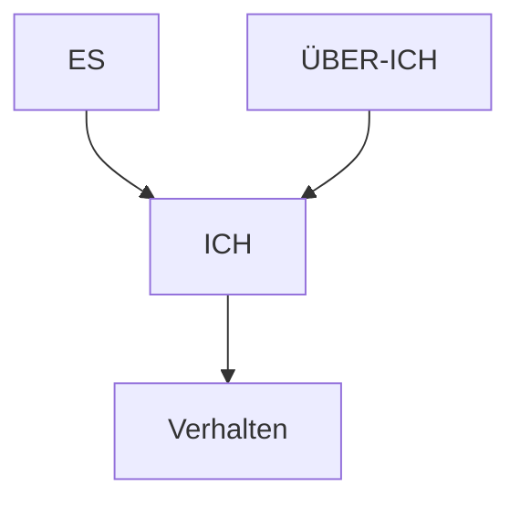

# Tiefenpsychologie

> Das Unbewusste als treibende Kraft

---

## Überblick

| Aspekt        | Information                              |
| ------------- | ---------------------------------------- |
| **Zeit**      | Ab ~1900                                 |
| **Begründer** | Sigmund Freud                            |
| **Fokus**     | Unbewusste seelische Vorgänge            |
| **Methode**   | Deutung, freie Assoziation, Traumanalyse |

---

## Grundannahme

> **Unbewusste** seelische Vorgänge beeinflussen unser Erleben und Verhalten

-   Vieles in der Psyche ist nicht bewusst zugänglich
-   Verdrängtes Material wirkt weiter
-   Kindheitserfahrungen prägen dauerhaft
-   Therapie = Bewusstmachen des Unbewussten

---

## Sigmund Freud (1856-1939)

→ [[Sigmund-Freud]]

### Begründer der Psychoanalyse

| Aspekt          | Information                         |
| --------------- | ----------------------------------- |
| **Lebensdaten** | 6. Mai 1856 - 23. September 1939    |
| **Geburtsort**  | Freiberg (heute Příbor, Tschechien) |
| **Wirkungsort** | Wien                                |
| **Emigration**  | 1938 nach London                    |

---

### Das Topographische Modell

**Drei Ebenen der Psyche:**

```
┌─────────────────────────────┐
│        BEWUSST              │  ← Aktuell im Bewusstsein
├─────────────────────────────┤
│      VORBEWUSST             │  ← Abrufbar (Erinnerungen)
├─────────────────────────────┤
│                             │
│       UNBEWUSST             │  ← Verdrängt, nicht zugänglich
│                             │
└─────────────────────────────┘
```

---

### Das Strukturmodell (Instanzenmodell)



| Instanz      | Funktion        | Prinzip             | Inhalt            |
| ------------ | --------------- | ------------------- | ----------------- |
| **Es**       | Triebe, Wünsche | Lustprinzip         | Angeborene Triebe |
| **Ich**      | Vermittlung     | Realitätsprinzip    | Realitätsprüfung  |
| **Über-Ich** | Moral           | Moralisches Prinzip | Gewissen, Ideale  |

**Das Ich:**

-   Vermittelt zwischen Es, Über-Ich und Realität
-   "Reiter auf dem Pferd" (Es)
-   Muss Kompromisse finden

---

### Triebtheorie

**Zwei Grundtriebe:**

| Trieb           | Bezeichnung | Ziel                        |
| --------------- | ----------- | --------------------------- |
| **Lebenstrieb** | Eros        | Selbsterhaltung, Sexualität |
| **Todestrieb**  | Thanatos    | Aggression, Destruktion     |

**Libido:**

-   Psychische Energie des Lebenstriebs
-   Ursprünglich sexuell konzipiert
-   Kann verschoben werden (Sublimierung)

---

### Psychosexuelle Entwicklung

| Phase         | Alter       | Erogene Zone | Konflikt             |
| ------------- | ----------- | ------------ | -------------------- |
| **Oral**      | 0-1 J.      | Mund         | Entwöhnung           |
| **Anal**      | 1-3 J.      | After        | Sauberkeitserziehung |
| **Phallisch** | 3-6 J.      | Genitalien   | Ödipuskomplex        |
| **Latenz**    | 6-12 J.     | -            | Ruhephase            |
| **Genital**   | ab Pubertät | Genitalien   | Reife Sexualität     |

**Fixierung:** Steckenbleiben in einer Phase → Persönlichkeitsprobleme

---

### Abwehrmechanismen

| Mechanismus          | Beschreibung                       | Beispiel                        |
| -------------------- | ---------------------------------- | ------------------------------- |
| **Verdrängung**      | Ins Unbewusste schieben            | Trauma vergessen                |
| **Projektion**       | Eigenes anderen zuschreiben        | "Du bist wütend!" (ich bin es)  |
| **Rationalisierung** | Vernünftige Erklärung erfinden     | "Ich wollte den Job eh nicht"   |
| **Sublimierung**     | Triebe in sozial akzeptable Kanäle | Aggression → Sport              |
| **Reaktionsbildung** | Ins Gegenteil verkehren            | Übertriebene Freundlichkeit     |
| **Regression**       | Rückfall in frühere Phase          | Kindliches Verhalten bei Stress |

---

## Alfred Adler (1870-1937)

### Individualpsychologie

**Abspaltung von Freud (1911)**

### Kernkonzepte

| Konzept                     | Beschreibung                           |
| --------------------------- | -------------------------------------- |
| **Minderwertigkeitsgefühl** | Universell, Antrieb zur Entwicklung    |
| **Kompensation**            | Ausgleich von Schwächen                |
| **Überkompensation**        | Exzessive Kompensation → Probleme      |
| **Geltungsstreben**         | Wunsch nach Bedeutung                  |
| **Gemeinschaftsgefühl**     | Gesunder Ausgleich zum Geltungsstreben |

**Neurose nach Adler:**

-   Überkompensation von Unzulänglichkeiten
-   Mangelndes Gemeinschaftsgefühl
-   Überstarkes Geltungsstreben

---

## Carl Gustav Jung (1875-1961)

### Analytische Psychologie

**Trennung von Freud (1913)**

### Kernkonzepte

| Konzept                      | Beschreibung                                  |
| ---------------------------- | --------------------------------------------- |
| **Libido**                   | Allgemeine Lebensenergie (nicht nur sexuell!) |
| **Persönliches Unbewusstes** | Individuelle verdrängte Inhalte               |
| **Kollektives Unbewusstes**  | Gemeinsames Erbe der Menschheit               |
| **Archetypen**               | Universelle Urbilder                          |

### Das kollektive Unbewusste

> Tiefste Schicht der Psyche, allen Menschen gemeinsam

-   Enthält **Archetypen** (Urbilder)
-   Vererbt, nicht erworben
-   Zeigt sich in Mythen, Träumen, Symbolen

### Wichtige Archetypen

| Archetyp         | Bedeutung                    |
| ---------------- | ---------------------------- |
| **Anima/Animus** | Weiblicher/männlicher Anteil |
| **Schatten**     | Verdrängte, dunkle Seiten    |
| **Persona**      | Soziale Maske                |
| **Selbst**       | Ganzheit, Integration        |
| **Magna Mater**  | Große Mutter                 |
| **Alter Weiser** | Weisheit, Führung            |

### Persönlichkeitstypen

| Dimension       | Pole                                 |
| --------------- | ------------------------------------ |
| **Einstellung** | Extraversion ↔ Introversion          |
| **Funktionen**  | Denken, Fühlen, Empfinden, Intuieren |

> Jung prägte die Begriffe Extraversion/Introversion!

---

## Weitere Vertreter

| Person            | Beitrag                            |
| ----------------- | ---------------------------------- |
| **Anna Freud**    | Ich-Psychologie, Abwehrmechanismen |
| **Melanie Klein** | Objektbeziehungstheorie            |
| **Heinz Kohut**   | Selbstpsychologie                  |
| **Erik Erikson**  | Psychosoziale Entwicklung          |

---

## Kritik an der Tiefenpsychologie

| Kritikpunkt                 | Beschreibung                |
| --------------------------- | --------------------------- |
| **Wissenschaftlichkeit**    | Schwer falsifizierbar       |
| **Überbetonung Sexualität** | Bei Freud                   |
| **Retrospektiv**            | Nur rückblickende Erklärung |
| **Kulturgebunden**          | Wiener Bürgertum um 1900    |
| **Lange Therapiedauer**     | Nicht ökonomisch            |

---

## Prüfungsrelevanz

**Must-Know:**

-   Topographisches Modell (bewusst/vorbewusst/unbewusst)
-   Strukturmodell (Es/Ich/Über-Ich)
-   Lustprinzip, Realitätsprinzip
-   Wichtige Abwehrmechanismen
-   Adler: Minderwertigkeitsgefühl, Kompensation
-   Jung: Kollektives Unbewusstes, Archetypen

---

## Verknüpfungen

-   [[Geschichte-der-Psychologie]]
-   [[Psychologische-Schulen]]
-   [[Sigmund-Freud]]
-   [[08-Persoenlichkeitspsychologie]]
