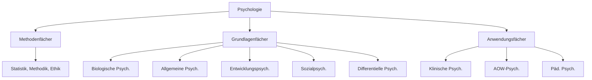

# Was ist Psychologie?

> **Psychologie** = griech. "psyche" (Seele) + "logos" (Wissenschaft) →
> **Wissenschaft vom Erleben und Verhalten des Menschen**

---

## Kernkonzepte

### Definition

-   Psychologie = Wissenschaft vom **Erleben und Verhalten** des Menschen
-   Inkludiert auch **kognitive Prozesse** (Denken)
-   Siehe: [[Kognition]]

### Vier Ziele der Psychologie

1. **Beschreiben** - Ist-Zustand erfassen, Daten sammeln
2. **Erklären** - Theorien entwickeln, Muster erkennen
3. **Vorhersagen** - Wahrscheinlichkeit von Verhalten einschätzen
4. **Verändern** - Verhaltensänderung bewirken (z.B. Therapie)

---

## Teildisziplinen

### Methoden-, Grundlagen- & Anwendungsfächer

### Grundlagenfächer im Detail

| Fach                               | Fragestellung                         | Beispiel                                           |
| ---------------------------------- | ------------------------------------- | -------------------------------------------------- |
| [[04-Biologische-Psychologie]]     | Wie ist X im Körper/Gehirn verankert? | Wie verarbeitet das Gehirn visuelle Info?          |
| [[05-Allgemeine-Psychologie]]      | Welche allgemeinen Prozesse?          | Wie funktioniert Wahrnehmung?                      |
| [[06-Entwicklungspsychologie]]     | Wie entwickelt sich X?                | Wann lernen Kinder Perspektivübernahme?            |
| [[07-Sozialpsychologie]]           | Wie beeinflussen andere X?            | Verändert Gruppenpräsenz die Wahrnehmung?          |
| [[08-Persoenlichkeitspsychologie]] | Welche Unterschiede gibt es?          | Nimmt ein Extrovertierter Situationen anders wahr? |

### Anwendungsfächer

-   **Klinische Psychologie** - Psychische Störungen, Therapie
-   **Pädagogische Psychologie** - Lernen, Bildung, Motivation
-   **AOW-Psychologie** - Arbeit, Organisation, Wirtschaft
-   **Gesundheitspsychologie** - Prävention, Gesundheitsförderung
-   **Psychologische Diagnostik** - Tests, Verfahren

---

## Ansätze der Psychologie

→ Detailliert: [[Psychologische-Ansaetze]]

| Ansatz                    | Fokus                                      | Vertreter                           |
| ------------------------- | ------------------------------------------ | ----------------------------------- |
| **Psychodynamisch**       | Unbewusste Triebe, innere Konflikte        | [[Sigmund-Freud]]                   |
| **Behavioristisch**       | Beobachtbares Verhalten, Reiz-Reaktion     | [[John-Watson]]                     |
| **Humanistisch**          | Selbstverwirklichung, positive Entwicklung | [[Carl-Rogers]], [[Abraham-Maslow]] |
| **Kognitiv**              | Denken, Wahrnehmung, mentale Prozesse      | -                                   |
| **Biologisch-neurowiss.** | Gehirn, Gene, Hormone                      | -                                   |

> **Eklektischer Ansatz** = Kombination mehrerer Perspektiven

---

## Ethische Prinzipien (APA)

→ [[Ethik-in-der-Psychologie]]

1. **Wohltätigkeit & Nicht-Schaden** - Wohl aller Beteiligten
2. **Loyalität & Verantwortung** - Professionelle Standards
3. **Integrität** - Ehrlichkeit, keine Täuschung
4. **Gerechtigkeit** - Gleichbehandlung
5. **Respekt** - Würde, Privatsphäre, Selbstbestimmung

---

## Erklärende Faktoren für Verhalten

| Typ               | Definition                        | Beispiele                          |
| ----------------- | --------------------------------- | ---------------------------------- |
| **Dispositional** | Zeitlich stabile, innere Merkmale | Gene, Persönlichkeit, Fähigkeiten  |
| **Situativ**      | Äußere Umweltfaktoren             | Andere Personen, Wetter, Situation |

---

## Verknüpfungen

-   Nächstes Kapitel: [[Geschichte-der-Psychologie]]
-   Überblick: [[00-Index]]
